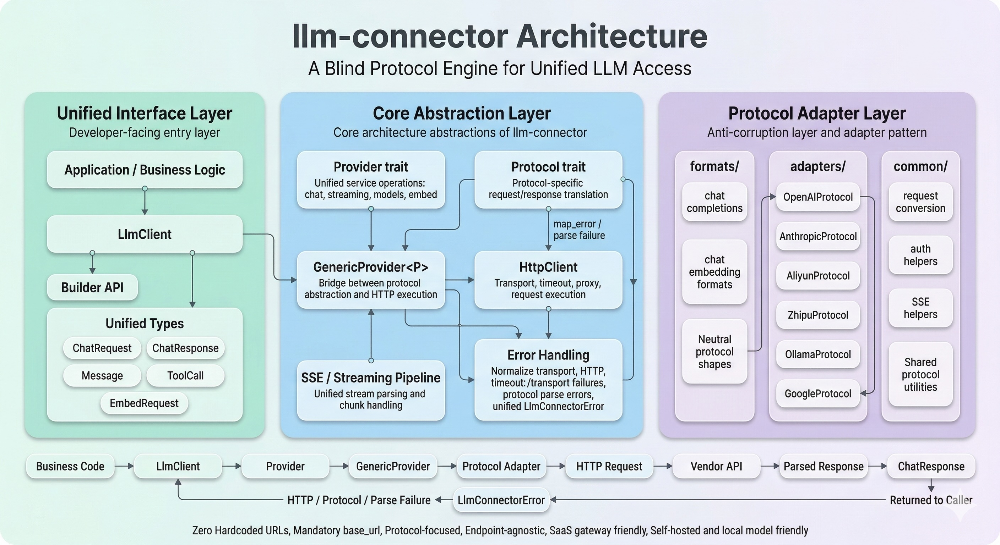

<div align="center">

<h1>llm-connector</h1>

[](https://crates.io/crates/llm-connector)
[](https://github.com/lipish/llm-connector)
[](https://crates.io/crates/llm-connector)
[](https://www.rust-lang.org)
[](https://docs.rs/llm-connector)
[](LICENSE)

**The Blind Protocol Engine** - A pure, URL-agnostic adapter for LLM services.

[Installation](#installation) • [Protocol Architecture](#protocol-layer-architecture) • [Usage](#usage)

</div>

---

## 🚀 The Pure Protocol Engine

`llm-connector` is a **minimalist, standalone driver layer** for AI providers. Unlike other libraries that maintain lists of provider endpoints, `llm-connector` adopts a **Pure Gateway Architecture**: it handles protocol adaptation, streaming, and token normalization, but remains completely "blind" to API endpoints.

- **Zero Hardcoded URLs**: No default endpoints. You provide the `base_url`, we provide the protocol.
- **Pure Positioning**: We don't care where the model is hosted (SaaS, Local, Private Cloud). We only care about the *dialect* (Protocol) it speaks.
- **Standalone & Light**: `llm-connector` is self-contained. It does **not** depend on any endpoint management projects or external databases.

## 🤝 Ecosystem Decoupling

While `llm-connector` is the **engine (Protocol)**, it is designed to work seamlessly with (but not depend on) configuration managers like [llm-providers](https://github.com/lipish/llm-providers).

- **llm-connector**: Handles *how* to talk (Request/Response logic).
- **llm-providers**: (External) Handles *where* to talk (URL/Region discovery).

This decoupling ensures that `llm-connector` remains a stable, logic-only library while the rapidly changing landscape of AI endpoints is managed elsewhere.

## 🏗️ Protocol Layer Architecture



The `src/protocols/` module is a strict **Anti-Corruption Layer (ACL)** built with the **Adapter Pattern**.
It isolates your application from vendor-specific API drift by enforcing a single internal contract (`ChatRequest`/`ChatResponse`) and translating it into each vendor's JSON dialect.

- **`formats/` (Neutral shapes)**: Protocol-agnostic structures (e.g. chat completions / embeddings) used as internal “truth”.
- **`adapters/` (Vendor dialects)**: Each adapter translates unified requests into vendor payloads and maps vendor responses back.
- **`common/` (Shared tools)**: Reusable conversion helpers, auth header strategies, and SSE/stream utilities.

In most cases, adding a new provider is “add an adapter + reuse generic execution”, without touching application code.

## 🛠️ Installation

**MSRV**: Rust 1.85+ (Rust 2024 edition)

```toml
[dependencies]
llm-connector = "1.0.2"
tokio = { version = "1", features = ["full"] }
```

## 📖 Usage

### Unified Chat

All client constructions now **mandatorily require** a `base_url`.

```rust
use llm_connector::{LlmClient, types::{ChatRequest, Message, Role}};

// Positioned as a blind protocol engine: You must provide the base_url
let client = LlmClient::openai("sk-...", "https://api.openai.com/v1")?;

let request = ChatRequest::new("gpt-4o")
    .add_message(Message::user("What is the speed of light?"));

let response = client.chat(&request).await?;
println!("{}", response.content);
```

### Universal Streaming

```rust
use llm_connector::{LlmClient, types::{ChatRequest, Message, Role}};
use futures_util::StreamExt;

let client = LlmClient::anthropic("sk-ant-...", "https://api.anthropic.com")?;
let request = ChatRequest::new("claude-3-5-sonnet-20240620").with_stream(true);

let mut stream = client.chat_stream(&request).await?;
while let Some(chunk) = stream.next().await {
    if let Some(content) = chunk?.get_content() {
        print!("{}", content);
    }
}
```

### Fluent Builder

```rust
let client = LlmClient::builder()
    .openai("sk-...")
    .base_url("https://api.deepseek.com") // Mandatory
    .timeout(60)
    .build()?;
```

## Advanced Features

### Reasoning & Thinking

Support for reasoning models like OpenAI o1/o3 and Claude 3.7 Sonnet.

```rust
use llm_connector::types::ReasoningEffort;

let request = ChatRequest::new("claude-3-7-sonnet-20250219")
    .add_message(Message::user("Solve this logic puzzle..."))
    .with_thinking_budget(16000) // Enable thinking with 16k token budget
    .with_max_tokens(20000);     // Ensure max_tokens > thinking_budget

let response = client.chat(&request).await?;
```

### Dynamic Service Resolution

Resolve API keys and endpoints dynamically based on model name.

```rust
use llm_connector::core::{EnvVarResolver, ServiceResolver};

let resolver = EnvVarResolver::new()
    .with_mapping("gpt", "OPENAI_API_KEY")
    .with_mapping("claude", "ANTHROPIC_API_KEY");

let target = resolver.resolve("claude-3-opus").await?;
// Use target.api_key and target.endpoint to configure your request
```

### File & Image Upload

Easily upload local files (Images, PDFs) with automatic Base64 encoding and MIME type detection.

```rust
use llm_connector::types::MessageBlock;

let request = ChatRequest::new("claude-3-5-sonnet")
    .add_message(Message::user("Analyze this document"))
    .add_message_block(MessageBlock::from_file_path("report.pdf")?);

let response = client.chat(&request).await?;
```

## 📜 License

MIT
